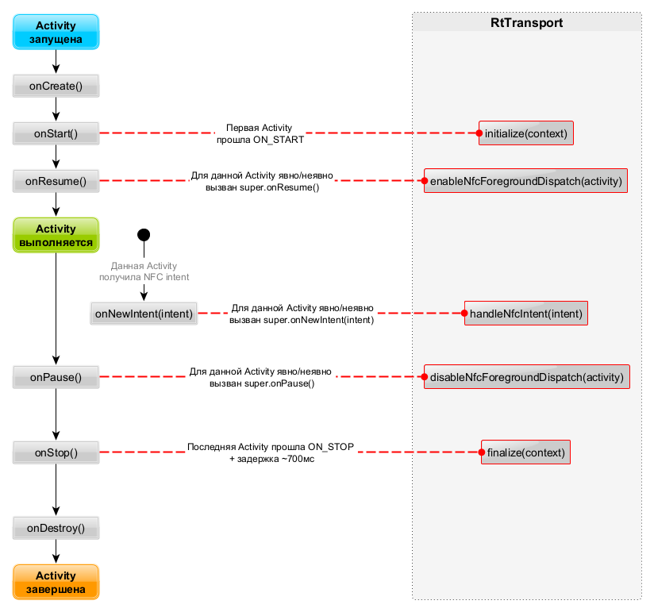

# Интеграция Рутокен в ОС Android без приложения "Панель управления Рутокен"
## Поддерживаемые версии ОС Android
Android - 7.0 (API Level 24) и новее.

> ⚠️
>Для корректной работы встраивания на **Android 7.0** и **7.1** (при условии, что минимальная версия приложения **меньше API Level 26**) необходимо включить **[desugaring](https://developer.android.com/studio/write/java8-support#library-desugaring)**.
## Настройка проекта
Для встраивания необходимо добавить в зависимости библиотеку **rtpcscbridge** (в случае использования системы сборки Gradle):
```groovy
implementation 'ru.rutoken.rtpcscbridge:rtpcscbridge:1.2.0'
```

Библиотека доступна в репозитории [Maven Central](https://search.maven.org/artifact/ru.rutoken.rtpcscbridge/rtpcscbridge).

Входная точка встраивания – класс **ru.rutoken.rtpcscbridge.RtPcscBridge**, который необходим для инициализации библиотеки.

Для каждого процесса приложения, в котором происходит взаимодействие с Рутокенами, необходимо вызвать статический метод `setAppContext` и передать ему в качестве параметра **Android application context**. \
Типичное место вызова этого метода - внутри **onCreate()** у класса-наследника **Application**:
```java
public class App extends Application {
    @Override
    public void onCreate() {
        super.onCreate();
        RtPcscBridge.setAppContext(this);
    }
}
```

## Режимы работы встраивания
### Общая информация
Встраивание поддерживает два режима работы: 
* **ручной**; 
* **автоматический**.

При **ручном режиме** пользователь библиотеки  осуществляет явный вызов методов ее инициализации и финализации, а также управляет отслеживанием Рутокенов с NFC. <br> Это обеспечивает полный контроль над поведением библиотеки со стороны приложения, например, при необходимости активации встраивания только для некоторых  Activity приложения.

 При **автоматическом** режиме встраивание доступно для всех Activity приложения, реализующих интерфейс [OnNewIntentProvider](https://developer.android.com/reference/androidx/core/app/OnNewIntentProvider) (методы ручного API вызываются автоматически на определенных этапах жизненного цикла приложения, см. [диаграмму](#picture1)).

При вызове инициализации библиотеки, с помощью класса **ru.rutoken.rttransport.InitParameters** можно изменить физические интерфейсы Рутокенов (USB, NFC, Bluetooth, SPI), которые должны поддерживаться приложением.

> ⚠️
>По умолчанию библиотека поддерживает Рутокены только с **USB** и **NFC** интерфейсами.

Для изменения поддерживаемых физических интерфейсов необходимо вызвать метод `InitParameters.Builder.setEnabledTokenInterfaces()`, который принимает как минимум один интерфейс.

Встраивание позволяет отслеживать подключение и отключение устройств Рутокен с помощью интерфейса **ru.rutoken.rttransport.RtTransport.PcscReaderObserver**. <br> Отслеживание подключения/отключения устройств особенно полезно при работе через КриптоПро CSP.

**Для включения отслеживания** (в любой момент работы со встраиванием) используются интерфейс `ru.rutoken.rttransport.RtTransport` и метод `addPcscReaderObserver()`. <br>
При этом подписчик получит события о всех подключенных к устройству Рутокенах (для каждого из них будет вызван  метод `RtTransport.PcscReaderObserver.onReaderAdded(reader)`). 

**Для остановки отслеживания** используется метод `RtTransport.removePcscReaderObserver()`.

> ⚠️ 
> Если подписка осуществляется внутри Activity или другого компонента, который может быть создан несколько раз за время жизни приложения, то необходимо своевременно **отписываться** во избежание утечек. <br> **Например**: <br> Если подписка была произведена внутри **Activity.onStart()**, то отписаться необходимо внутри **Activity.onStop()**.

### <a id="title1">Ручной API встраивания</a>
Для работы с Рутокенами в ручном режиме используется интерфейс **ru.rutoken.rttransport.RtTransport**. Его инстанс можно получить с помощью метода `RtPcscBridge.getTransport()`.   
Рекомендуемый порядок вызовов API:   
|**Порядок вызова**|**Наименование**|**Описание**|**Место вызова**|
|--------------------|------------------|------------|-------|
|1|`RtTransport.initialize(context)`|Инициализирует встраивание. <br> Библиотека начинает отслеживать подключение и отключение устройств Рутокен (кроме подключений по NFC) и позволяет настроить дальнейшую работу с NFC.  <br> В этот метод можно передать `ru.rutoken.rttransport.InitParameters` для возможности выбора физических интерфейсов Рутокена для поддержки приложением |Рекомендуется: <br> - в методе **Activity.onStart**;  <br> - в методе **Service.onCreate** – в случае использования внутри сервиса.|
|2|`RtTransport.enableNfcForegroundDispatch(activity)`|Включает [NFC foreground dispatching](https://developer.android.com/guide/topics/connectivity/nfc/advanced-nfc#foreground-dispatch) для данной Activity|**ТОЛЬКО** из **Main потока** в методе **Activity.onResume**|
|3|`RtTransport.handleNfcIntent(intent)`|Обрабатывает NFC интент, полученный при прикладывании Рутокенов. <br> Интенты от устройств других производителей не обрабатываются.  <br> Применяется для дальнейшей установки соединения с Рутокеном|При получении **каждого** NFC интента.  <br> **Например**: <br> внутри **Activity.onNewIntent**|
|4|`RtTransport.disableNfcForegroundDispatch(activity)`|Выключает  [NFC foreground dispatching](https://developer.android.com/guide/topics/connectivity/nfc/advanced-nfc#foreground-dispatch) для данной Activity|**ТОЛЬКО** из **Main потока** в методе **Activity.onPause()**|
|5|`RtTransport.finalize(context)`|Завершает работу встраивания|Рекомендуется: <br> - в методе **Activity.onStop**; <br> - в методе **Service.onDestroy** – в случае использования внутри сервиса.|

### Автоматический API встраивания
Для работы с Рутокенами в автоматическом режиме используется интерфейс **ru.rutoken.rttransport.RtTransportExtension**. Его инстанс можно получить из метода `RtPcscBridge.getTransportExtension()`. <br> Для включения режима необходимо вызвать метод `attachToLifecycle` внутри класса-наследника **Application**:
```java
public class App extends Application {
    @Override
    public void onCreate() {
        super.onCreate();
        RtPcscBridge.setAppContext(this);
        RtPcscBridge.getTransportExtension().attachToLifecycle(this, true);
    }
}
```
В параметры метода `attachToLifecycle` дополнительно можно передать:
 * флаг **useAutoNfcHandling** для включения/выключения автоматической обработки Рутокенов с NFC. По умолчанию значение флага - **true**;
 * параметры инициализации `ru.rutoken.rttransport.InitParameters`, в которых можно выбрать поддержку конкретных физических интерфейсов Рутокенов. 
 
> ⚠️ 
Вызов метода **attachToLifecycle** должен осуществляться **именно** в **Application.onCreate()**. <br> Если метод будет вызван позднее (например, внутри callback жизненного цикла Activity), то встраивание может не получить сигнал о переходе приложения в нужное состояние и не активирует работу с NFC.

> ⚠️ 
> Автоматическая обработка Рутокенов с NFC осуществляется только на тех Activity, которые реализуют [OnNewIntentProvider](https://developer.android.com/reference/androidx/core/app/OnNewIntentProvider).

Для выключения автоматического режима используется метод `RtPcscBridge.getTransportExtension().detachFromLifecycle(app)`. <br> Если взаимодействие с Рутокеном осуществляется на протяжении всей работы приложения, то данный метод можно не вызывать.
## Автоматический API и жизненный цикл приложения
Жизненный цикл автоматического API непосредственно связан с жизненными циклами всех Activity приложения. <br>
Вызов метода `RtTransportExtension.attachToLifecycle(app)` инициирует следующие операции внутри библиотеки:
- добавление подписчика **ru.rutoken.rttransport.RtTransportProcessLifecycleObserver** на [жизненный цикл процесса приложения](https://developer.android.com/reference/androidx/lifecycle/ProcessLifecycleOwner#getLifecycle()).
- добавление **ru.rutoken.rttransport.RtTransportNfcLifecycleCallbacks** в качестве [Activity Lifecycle callbacks](https://developer.android.com/reference/android/app/Application.ActivityLifecycleCallbacks) для данного приложения, при следующих условиях: 
   - параметр **useAutoNfcHandling** = **true**;
   - **NFC адаптер** физически **существует**;
   - включено отслеживание токенов по физическому интерфейсу **ru.rutoken.rttransport.TokenInterface.NFC**.

Ниже представлена диаграмма зависимости поведения **RtTransport** от жизненного цикла Activity при автоматическом режиме встраивания и включенном автоуправлении NFC.
#### Диаграмма жизненного цикла RtTransport
<a id="picture1"></a>

После перехода **первой Activity** в состояние **Started** (событие [Lifecycle.Event.ON_START](https://developer.android.com/reference/androidx/lifecycle/Lifecycle.Event#ON_START)) вызывается инициализация **RtTransport**. <br>После перехода **последней** Activity в состояние **Stopped** (событие [Lifecycle.Event.ON_STOP](https://developer.android.com/reference/androidx/lifecycle/Lifecycle.Event#ON_STOP)) вызывается финализация **RtTransport**.  Вызов финализации осуществляется **с задержкой**, что исключает лишнюю переинициализацию в следующих случаях:
- смена конфигурации (переворот экрана)
- быстрое переключение между приложениями;
- быстрое переключение на Home screen и обратно.

При включенном автоуправлении NFC дополнительно автоматически вызываются:
|**Метод**|**Описание**|**Условия вызова**|
|-------|------------|--------|
|`enableNfcForegroundDispatch()`|Включает [NFC foreground dispatching](https://developer.android.com/guide/topics/connectivity/nfc/advanced-nfc#foreground-dispatch) для данной Activity|Если метод **Activity.onResume()** переопределен – при **super.onResume()** <br> Иначе – неявно во время перехода в состояние **Resumed**|
|`handleNfcIntent()`|Обрабатывает NFC интент, полученный при прикладывании устройств Рутокен. <br> Интенты от устройств других производителей не обрабатываются. <br> Применяется для дальнейшей установки соединения с Рутокен| Если метод **Activity.onNewIntent()** переопределен - при **super.onNewIntent()** <br> Иначе - автоматически во время получения NFC интента|
|`disableNfcForegroundDispatch()`|Выключает [NFC foreground dispatching](https://developer.android.com/guide/topics/connectivity/nfc/advanced-nfc#foreground-dispatch) для данной Activity| Если метод **Activity.onPause()** переопределен - при **super.onPause()** <br> Иначе - неявно во время перехода в состояние **Paused**|

Когда Activity находится в стадии Resumed, библиотека реагирует на события о состоянии NFC адаптера через внутренний BroadcastReceiver:
- при переходе в состояние [NfcAdapter.STATE_ON](https://developer.android.com/reference/android/nfc/NfcAdapter#STATE_ON)  вызывается **enableNfcForegroundDispatch()**;
- при переходе в состояние [NfcAdapter.STATE_OFF](https://developer.android.com/reference/android/nfc/NfcAdapter#STATE_OFF)  вызывается **disableNfcForegroundDispatch()**.

## Требования для встраивания в зависимости от физического интерфейса Рутокена
### USB
Для работы в **ручном режиме** достаточно вызвать методы `RtTransport.initialize(context)` и `RtTransport.finalize(context)`. 

В **автоматическом режиме** устройства обрабатываются без дополнительных  действий со стороны пользователя библиотеки. <br> При этом у конечного пользователя приложения при каждом подключении Рутокена отображается системный диалог с запросом разрешения на использование этого USB устройства. 

Поскольку интерфейс `ru.rutoken.rttransport.TokenInterface.USB` включен по умолчанию, допускается явно не передавать параметр  `ru.rutoken.rttransport.InitParameters` в методы инициализации библиотеки.

Дополнительных runtime permission получать не требуется.

### Bluetooth
Для работы по интерфейсу Bluetooth в методы инициализации обоих режимов встраивания необходимо передать параметр `ru.rutoken.rttransport.InitParameters` с поддержкой `ru.rutoken.rttransport.TokenInterface.BLUETOOTH`.  

Для работы в **ручном режиме** достаточно вызвать методы `RtTransport.initialize(context)` и `RtTransport.finalize(context)`. 

На **Android 12+** для всех режимов необходимо самостоятельно запросить permission **[BLUETOOTH_CONNECT](https://developer.android.com/reference/android/Manifest.permission#BLUETOOTH_CONNECT)**.

### NFC

Для работы в **ручном режиме** необходимо вызвать все методы раздела [Ручной API встраивания](#title1). <br>
Для работы в **автоматическом режиме** необходимо передать флаг **useAutoNfcHandling=true** в метод `attachToLifecycle` или использовать default метод `attachToLifecycle(application)`, который по умолчанию включает автоматическую обработку NFC.

Поскольку интерфейс `ru.rutoken.rttransport.TokenInterface.NFC` включен по умолчанию, допускается явно не передавать параметр  `ru.rutoken.rttransport.InitParameters` в методы инициализации библиотеки.

Дополнительных runtime permissions получать не требуется.

## Работа встраивания в многопроцессных приложениях
Корректность работы встраивания не гарантируется при одновременном использовании Рутокенов несколькими процессами приложения.

## Логирование
Уровень логирования в библиотеках по умолчанию - [ERROR](https://developer.android.com/reference/android/util/Log#ERROR).  <br>
Для отладки можно расширить логирование до уровня [DEBUG](https://developer.android.com/reference/android/util/Log#DEBUG), который содержит информацию об:
 * автоматической инициализации встраивания;
 * автоматической финализации встраивания;
 * обнаружении токенов по различным физическим интерфейсам.

Для этого необходимо вызвать `RtPcscBridge.enableDebugLogs()` перед началом работы со встраиванием, а именно - до вызова `RtPcscBridge.setAppContext()`.
## Конфигурация R8/ProGuard
Начиная с **версии 1.2.0**, библиотека содержит конфигурационный файл **ProGuard**, который применяется автоматически при включении обфускации приложения.

Для корректной работы библиотеки **версии 1.1.1 и ниже** необходимо прописать следующие правила в proguard-rules.pro:
```
-dontwarn ru.rutoken.spi.SpiDevice
-dontwarn ru.rutoken.spi.SpiManager
-keep class ru.rutoken.rtcore.network.methodhandler.** { *; }
-keep class ru.rutoken.rtpcscbridge.** { *; }
-keep class * extends com.google.protobuf.GeneratedMessageLite { *; }
```

При использовании расширенного логирования (уровень  [DEBUG](https://developer.android.com/reference/android/util/Log#DEBUG)), для сохранения читаемости логов, необходимо прописать следующие правила в proguard-rules.pro:
```
-dontwarn ru.rutoken.spi.SpiDevice
-dontwarn ru.rutoken.spi.SpiManager
-keep class ru.rutoken.rttransport.** { *; }
-keep class ru.rutoken.rtcore.** { *; }
-keep class ru.rutoken.rtpcscbridge.** { *; }
-keep class * extends com.google.protobuf.GeneratedMessageLite { *; }
```
